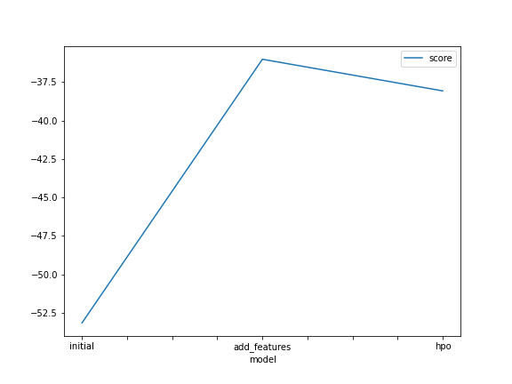
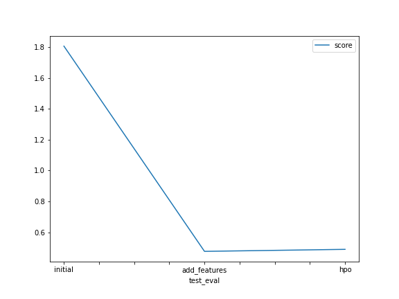

# Report: Predict Bike Sharing Demand with AutoGluon Solution
#### M Muchsin

## Initial Training
### What did you realize when you tried to submit your predictions? What changes were needed to the output of the predictor to submit your results?
everything is fine, there's no need to change the output of the predictor

### What was the top ranked model that performed?
`WeightedEnsemble_L3` with `score-val`	**-53.147278**

## Exploratory data analysis and feature creation
### What did the exploratory analysis find and how did you add additional features?
found:
- most of the bikes are rented on working days.
- `datetime` needs to be parsed into a more specific feature (year, month, day).
- most of the bikes are rented when the weather is clear or few clouds.
- autogluon originally sees `season` and `weather` as `int`, but in reality they are int representations of a `category`.

action taken:
* parse datetime to year, month, and day as additional features.
* convert `season` and `weather` as `category` features.
### How much better did your model preform after adding additional features and why do you think that is?
the model performs significantly better from the initial model, with `score-val` from **-53.147278** becoming **-36.022257**.

## Hyper parameter tuning
### How much better did your model preform after trying different hyper parameters?
hyperparameter optimization did a great job but not as good as feature engineering.

### If you were given more time with this dataset, where do you think you would spend more time?
i'll spend more time on feature engineering.

### Create a table with the models you ran, the hyperparameters modified, and the kaggle score.
| model | hpo1 | hpo2 | hpo3 | score |
|---|---|---|---|---|
| initial | default | default | default | 1.80664 |
| add_features | default | default | default | 0.47635 |
| hpo | {'GBM': {'num_boost_round': 100, 'num_leaves': Int: lower=26, upper=66}, 'NN': {'num_epochs': 10, 'learning_rate': Real: lower=1e-05, upper=10, 'activation': ['relu', 'softrelu', 'leakyrelu'], 'layers': [[100], [1000], [200, 100], [300, 200, 100]], 'dropout_prob': Real: lower=0.0, upper=0.5}} | {'GBM': {'num_boost_round': 100, 'num_leaves': Int: lower=26, upper=66}, 'NN': {'num_epochs': 10, 'learning_rate': Real: lower=1e-05, upper=10.0, 'activation': ['relu', 'softrelu', 'leakyrelu'], 'layers': [[100], [1000], [200, 100], [300, 200, 100]], 'dropout_prob': Real: lower=0.0, upper=0.5}, 'XGB': {'eta': Real: lower=1e-05, upper=10.0, 'max_depth': Int: lower=2, upper=10, 'sampling_method': ['uniform', 'gradient_based']}} | {'GBM': {'num_boost_round': 100, 'num_leaves': Int: lower=26, upper=66}, 'NN': {'num_epochs': 10, 'learning_rate': Real: lower=1e-05, upper=10.0, 'activation': ['relu', 'softrelu', 'leakyrelu'], 'layers': [[100], [1000], [200, 100], [300, 200, 100]], 'dropout_prob': Real: lower=0.0, upper=0.5}, 'XGB': {'eta': Real: lower=1e-05, upper=10.0, 'max_depth': Int: lower=2, upper=10, 'sampling_method': ['uniform', 'gradient_based']}, 'RF': {'max_depth': Int: lower=10, upper=100, 'max_features': ['log2', 'sqrt'], 'min_samples_leaf': Int: lower=1, upper=5, 'min_samples_split': Int: lower=2, upper=10... | 0.48942 |

### Create a line plot showing the top model score for the three (or more) training runs during the project.

### Create a line plot showing the top kaggle score for the three (or more) prediction submissions during the project.

## Summary
in this project:
- ensemble model outperforms other individual models.
- feature engineering did the best job to improve model performance.
- hyperparameter optimization did a great job but not as good as feature engineering.
